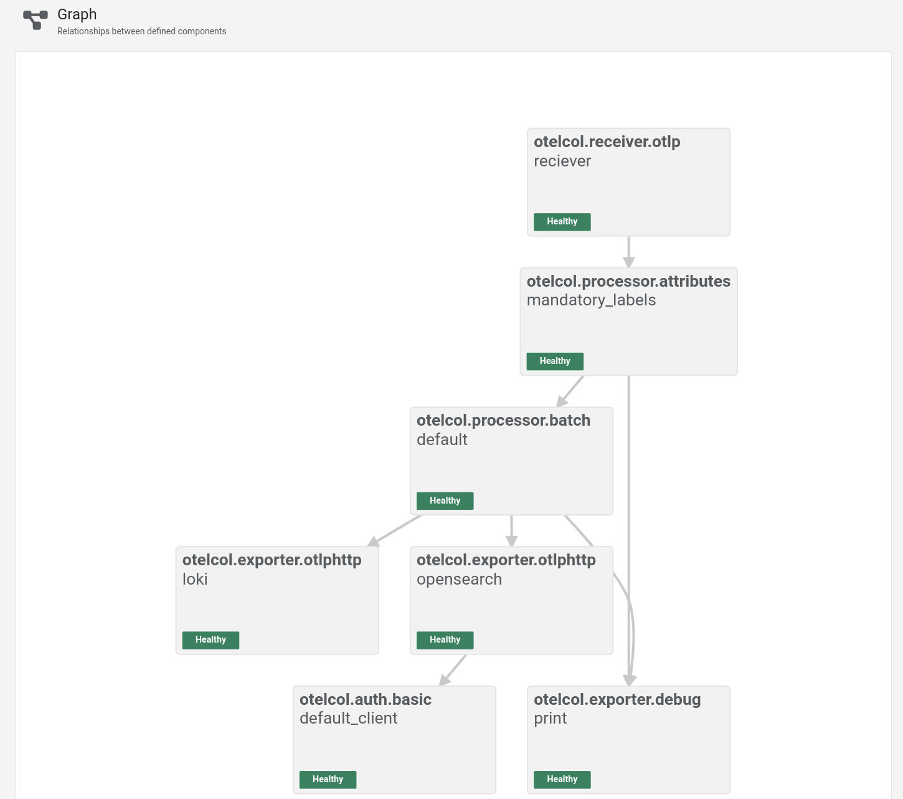
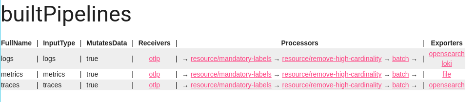
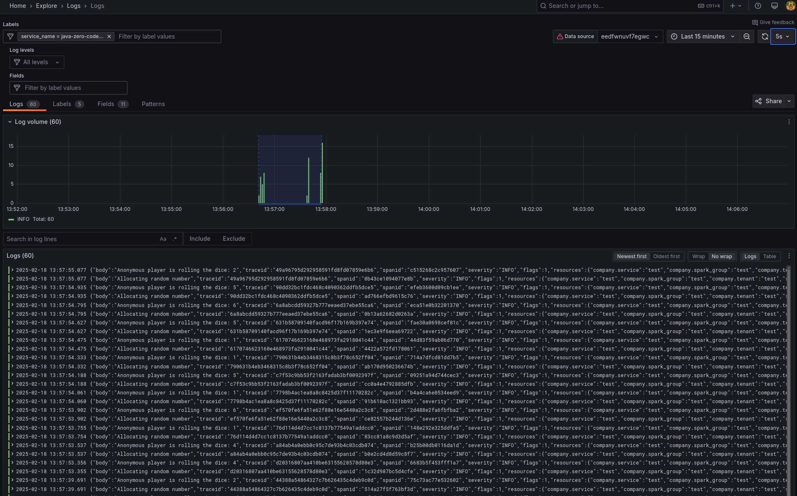

# Java Zero Code Local Otel Reference Template

This guide helps you set up and run a local OpenTelemetry reference app with minimal code changes. Follow these steps to get started.

## Prerequisites

Before you begin, make sure you have the following installed and set up on your machine:

- Docker/Podman: The OpenTelemetry Collector runs in a OCI container, so you'll need Docker installed on your system. [Install Docker](https://docs.docker.com/engine/install/) if you don't have it yet.

- Java (JDK 11 or later): You'll need Java installed to build and run the application. The app is built with Gradle, so ensure that Java is properly configured. [Install Java](https://www.openlogic.com/openjdk-downloads) (JDK 11 or later).

- Make: Make should come on all macos/linux machines [make](https://www.gnu.org/software/make/)

## Get started with make

Make is the simpliest way to get started once the above dependencies have been installed. You can run the demo with either alloy or the otel-collector.


### Alloy

```sh
make demo-alloy
```



### OTel Contrib Collector

```sh
make demo-otel
```




#### Make some requests

```sh
make request
```

### Check Grafana

[http://localhost:3000/](http://localhost:3000/)

Defaults to:
User: admin
Password: admin


### Check the Metrics

You can view the app's output logs by running:

```sh
tail -f metrics.json
```

This will display the metrics in real-time as the app runs.

### Check logs



By following these steps, you'll have the OpenTelemetry Collector or alloy running, your Java app instrumented with OpenTelemetry, and be able to observe telemetry data in form of logs, traces and metrics.
